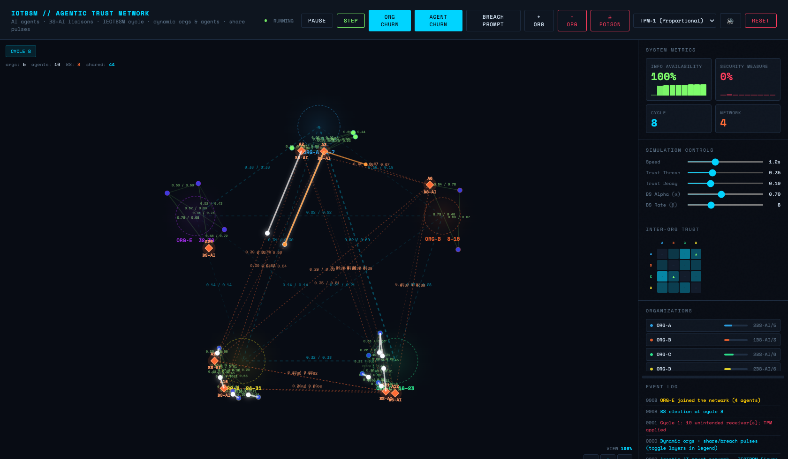

# IOTBSM — Agentic Trust Network (Browser Simulation)



Single-file, client-side simulation aligned with the **Inter-organizational Trust-based Security Model (IOTBSM)** in:

- Hexmoor, H., Wilson, S., & Bhattaram, S. (2006). [*A theoretical inter-organizational trust-based security model*](https://doi.org/10.1017/S0269888906000932). *The Knowledge Engineering Review*, 21(2), 127–161.

The UI frames the run as **AI agents**, **BS-AI liaisons** (boundary-spanner agents), an **IOTBSM Figure 5–style cycle**, and **§4.8**-style **information availability (IA)** and **security measure (SM)** readouts. The implementation is **pedagogical**: it follows the paper's structure (trust-gated sharing, BS-mediated cross-org flow, logistic inter-org trust, TPM on certain failures) but simplifies and extends it for the browser—sampled share pulses, optional dynamic orgs, optional poison-pill facts. (Implementation notes are in comments in `iotbsm_simulation.html`.)

## Quick start

1. Clone or download this repository.
2. Open `iotbsm_simulation.html` in a modern desktop browser (Chrome, Firefox, Safari, or Edge).

No build step or server is required. If your environment blocks `file://` scripts or fonts, serve the folder locally:

```bash
python3 -m http.server 8080
```

Then open `http://localhost:8080/iotbsm_simulation.html`.

## What you will see

**Canvas**

- **Organizations** as colored rings; **AI agents** as dots and **BS-AI** boundary spanners as diamonds.
- **Trust edges**: faint green = intra-org, cyan = inter-org (with numeric labels), orange = BS–BS. Edge labels show **`a / b`**: directed trust from the lower-id node to the higher-id node, then in the reverse direction (same rule for org centers, agent pairs, and BS pairs).
- **Animated pulses** (budget-limited per cycle): white = successful share hop, amber = denied cross-org hop (sampled), red = breach path from pedigree audit, violet = poison-pill hop (Denied/Breach layer). Legend rows toggle each layer.
- **Zoom / pan**: scroll wheel or pinch to zoom; **+/−/⊙** HUD buttons; Alt+drag or middle-drag to pan.
- **Canvas tooltips** on hover show agent reliability, trust, satisfaction, required fact and its owner org; org tooltips show agent count, average trust, and vocab range.

**Sidebar**

- **System Metrics** cards (IA, SM, Cycle, Network) with IA/SM sparklines; hover any card for a definition tooltip — Cycle and Network tooltips also include live counts.
- **Inter-Org Trust matrix**: live N×N heatmap (dark = 0, cyan = 1.0) of directed inter-org trust (Equation 5). Row = trust-holder, column = trusted org. Each cell shows a ▲/▼/— delta vs the previous cycle; hover for exact value and delta.
- **Private org vocabularies** (default on): each org owns a contiguous slice of the fact-value space (e.g. ORG-A: 0–7, ORG-B: 8–15; slice size `CFG.vocabSizePerOrg`, default 8). Agents generate only their org's values but require a value from another org's slice, making cross-org BS-AI sharing necessary for satisfaction. Org ring labels show the vocab range. Toggle off via `CFG.privateOrgVocab = false`.
- **Organizations** and **Event log** share the lower sidebar; drag the resize bar between them to adjust heights. The event log records elections, org/agent churn, breaches, TPM changes, and more.
- **Unintended receipt / breach scrutiny**: when the pedigree audit finds an unintended receiver (TPM applied), the simulation pauses and a modal offers **Resume simulation** or **View details** (fact, path, agents including BS-AI). Toggle **BREACH PROMPT** in the header to enable or disable this pause; the underlying flag is `CFG.pauseOnUnintendedAudit`.
- **Web Audio** cues (header **🔊** / **🔈** to mute).

## Simulation cycle (Figure 5 style, high level)

Each **cycle** the engine:

1. Optionally **re-elects BS-AI** every **β** cycles from intra-org **reliability**.
2. Each non–BS-AI agent **generates one new fact** (value drawn from the agent's org vocabulary when `CFG.privateOrgVocab` is true, or from the shared 20-value pool otherwise); facts carry **pedigree** and **pathTo** maps for audit.
3. **Intra-org sharing rounds**: agents attempt to pass holdings to peers in the same org when **trust ≥ threshold**, recipient **willing** (ISP4-style), and path bookkeeping allows it; deliveries go to **pending** then **inbox** after a **merge** step.
4. **Cross-org BS-AI sharing**: BS-AI agents forward holdings peer-to-peer using **α-blended** BS–BS trust vs inter-org trust; failed hops can be **deny-pulsed** (sampled).
5. The intra-org / merge pattern runs **multiple times** per cycle so facts can propagate in stages (see code block labeled Figure 5).
6. **Satisfaction** is updated from **accessible values** (this cycle's generation plus inbox / pending).
7. **§4.8-style audit** (`auditPedigreesAndTPM`): for **current-cycle** facts, every non-initiator on the pedigree with a recorded path (length ≥ 2) is classified as **intended** or **unintended** receipt from `pathTrustEdgesOk`. **Unintended** cases increment SM, **apply TPM** along the path, and may emit a **breach** pulse (classification does not require the recipient to still be unsatisfied at cycle end).
8. **Inter-org trust** updates via **equation (5)** with fixed **τ₀** per org pair (`tau0` stored at init).
9. If **`CFG.dynamicNetwork`** is true (default), orgs may **join** or **leave** after warm-up using configurable probabilities and min/max org counts.
10. If **`CFG.agentChurn`** is true (default), individual **AI agents** may **join** a random org (under **`maxAgentsPerOrg`**) or **leave** an org (keeping at least **`minAgentsPerOrg`** members) after warm-up. Header **AGENT CHURN** pauses/resumes this without affecting **ORG CHURN**. Facts that reference a removed agent are purged; BS-AI is re-elected after each change.

Additional **CFG** knobs in code include **pulse budget per cycle**, **intra-org pulse sampling rate**, **cross-org deny pulse sampling rate**, and **join/leave probabilities** for agents.

### Poison pill (trust cascade)

Header **☠ POISON** injects a special fact at a random **non–BS-AI** agent. It propagates through the same sharing rules as ordinary facts. On **every successful hop**, the engine:

- subtracts **`poisonHopDecay`** from the **directed** trust edge used for that hop;
- subtracts **`poisonRippleIntra`** from **every** directed intra-org edge in each **affected** organization (sender's org; on BS hops, both orgs);
- on **cross-org BS** hops, subtracts **`poisonInterOrgDecay`** from **both** directions of the **org–org** τ involved;
- subtracts **`poisonGlobalRipple`** from **every** org-pair τ (light network-wide stress so degradation spreads beyond the immediate path).

Violet pulses draw on the **Denied / Breach** layer. Optional **`CFG.poisonRandomChance`** (default **0**) can trigger rare automatic injections after warm-up.

## Metrics (this implementation)

The sidebar labels cite **§4.8**. Each cycle, `auditPedigreesAndTPM()` fills **per-cycle** `cycleIntended` and `cycleUnintended` (and `cycleTotalShared = intended + unintended`) from the pedigree audit only—**not** lifetime totals.

Let **shared-class** (for a given cycle) be `cycleTotalShared`, where those counts come only from **non-initiator pedigree positions** on **current-cycle** facts with `pathTo[recipient]` length ≥ 2. **Intended** if `pathTrustEdgesOk` passes on that path, **unintended** otherwise (TPM + breach pulse may apply). Recipients are counted **even if** they end the cycle satisfied, so IA/SM are not silently zeroed when luck or extra shares mask "still need info" at audit time.

**Display IA / SM** use a **rolling window** (last **15** cycles) of those counts: `sum(cycleIntended) / sum(cycleTotalShared) × 100` and the analogous ratio for unintended. That avoids the UI sitting at **0%** or **100%** almost every cycle when each tick only has **0–1** shared-class receipts (integer rounding of a single-cycle ratio).

| Display | Formula |
|--------|--------|
| **Info Availability (IA)** | Over the rolling window: `round((Σ intended / Σ shared-class) × 100)`, capped at **100%**, when `Σ shared-class > 0`; else **0%**. |
| **Security Measure (SM)** | Same window: `round((Σ unintended / Σ shared-class) × 100)`, capped at **100%**. |

When the window sum of **shared-class** is 0, IA and SM show **0%**. Otherwise **IA + SM ≈ 100%** (rounding may show 99% / 101% combined; each is clamped to 100%).

**Cycle** shows the simulation tick. **Network** shows org count, non-BS agents, and BS-AI count. Sparklines use the same rolling IA/SM values on a **fixed 0–100%** vertical scale.

## Controls and parameters

**Header**

- **PAUSE / RESUME**, **STEP** — run control. While the **breach scrutiny** modal is open, **RESUME** also dismisses it and continues.
- **ORG CHURN** — pause/resume automatic org join/leave (manual **+ ORG / − ORG** still work).
- **AGENT CHURN** — pause/resume agents randomly joining or leaving organizations.
- **BREACH PROMPT** — when **on** (highlighted), unintended-receipt audits **pause** the run and open the **scrutiny modal**; when **off**, audits and TPM still run but no modal (useful for unattended viewing).
- **+ ORG / − ORG** — add or remove the newest organization (subject to min-org guard).
- **TPM-1 / 2 / 3** — trust policy model (see "Trust Policy Models" section below).
- **☠ POISON** — inject a poison-pill fact at a random AI agent (see "Poison pill" section above).
- **🔊** — toggle sound effects.
- **RESET** — new run (four orgs by default, view reset).

There is **no** separate "fire one request" button; sharing is **continuous** each cycle.

**Simulation controls (sidebar)**

| Control | Role |
|---------|------|
| **Speed** | Milliseconds between automatic cycles (**200–3000**, step 100; lower = faster). |
| **Trust thresh** | Minimum trust for intra-org delivery and for the BS–BS **blended** gate in cross-org sharing / path audit. |
| **Trust decay** | **`dec`** in TPM formulas below. |
| **BS Alpha (α)** | Weight of **inter-org** vs **prior BS–BS** trust in the blend for cross-org edges and path checks. |
| **BS Rate (β)** | Cycles between **BS-AI re-elections**. |

Other defaults (BS fraction, fact expiration, dynamic-network probabilities, pulse budget, **`pauseOnUnintendedAudit`**, **`privateOrgVocab`**, **`vocabSizePerOrg`**, etc.) live on **`CFG`** in `iotbsm_simulation.html`.

## Trust Policy Models (TPM)

In this build, **`applyTPM` runs only from the pedigree audit**: when a receipt is classified **unintended** (trust along the recorded path fails the same tests as live sharing, and the recipient is still unsatisfied). It does **not** run on ordinary cross-org denials that never complete a delivery.

`result.path` is the agent-id list from initiator to recipient. **`applyTPM` returns immediately** if the path has fewer than two nodes. **`dec`** is **Trust decay** (`CFG.trustDecay`). Updated trust is clamped to **≥ 0**; missing edges use **0.5** before subtraction.

### TPM-1 — Proportional

For each hop index `k = 1 … |path|−1` (edge from `path[k−1]` to `path[k]`), let `degJ = |path|−1` and `degK = k`. The predecessor's trust in the successor is reduced by:

\[
\text{update} = \text{dec}^{\,(\mathrm{degJ} - \mathrm{degK} + 1)}
\]

With **`dec` ∈ (0, 1)**, later hops on the path typically receive **larger** decrements than earlier ones.

### TPM-2 — Uniform

Each edge on the path: subtract **`dec`** from the predecessor's trust in the successor (same as before).

### TPM-3 — Initiator-centric

The **initiator** agent reduces trust in every other id on the path by **`dec`**; other agents' matrices are unchanged.

### Inter-org extra term

If **`result.breach`** is true **and** `targetOrg` is passed, inter-org trust is also reduced by **`dec × 0.5`**. In the current audit call, **`targetOrg` is null**, so that branch does not run unless extended elsewhere.

### Relation to the paper

The KER paper discusses trust management in IOTBSM; these TPMs are **illustrative** for comparing sanctioning styles after **unintended receipt** in the audit—not a verbatim copy of one numbered policy.

## Files

| File | Description |
|------|-------------|
| `iotbsm_simulation.html` | Styles, UI, canvas, zoom/pan, sound, and full simulation (plain JavaScript; Google Fonts only). |
| `docs/iotbsm-simulation-preview.png` | Static screenshot for this README. |

## Disclaimer

This is an **educational simulation**. Numbers are chosen for clarity and stability in the browser, not for calibrating real organizations or production security.
